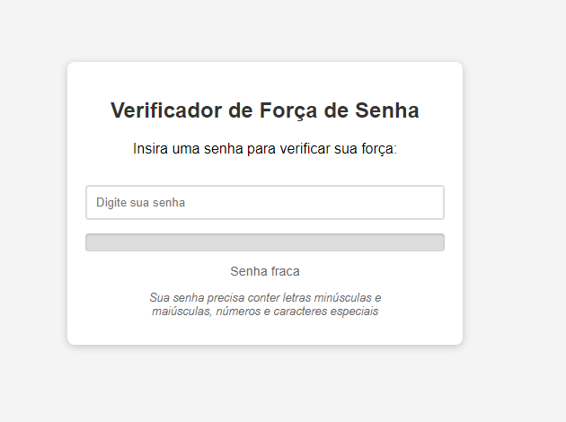

    
    
    

# Verificador - Força de Senha

  Projeto desenvolvido pelo canal Hora de Codar no youtube, com intuito de fazer uma verifiicação de força de senha. Baseado no HTML5 para o esqueleto do projeto, CSS3 para a estilização e toda parte de deixar o programa mais interativo com o que é digitado, o script js. Para o funcionamento ideal, foi utilizado alguns recursos do Javascript para fornecer um mecanismo de verificador em quanto ao digitar caracter, toda parte da linguagem de programação fosse usada para o resultado final. Conceitos como o dom do js, eventos e dentre outros recursos interessantes.

